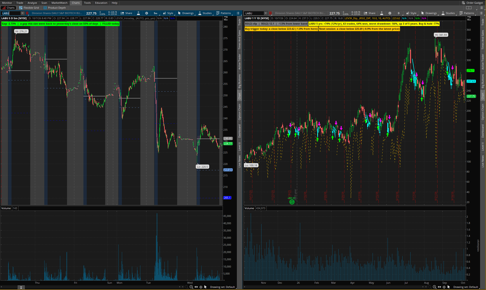
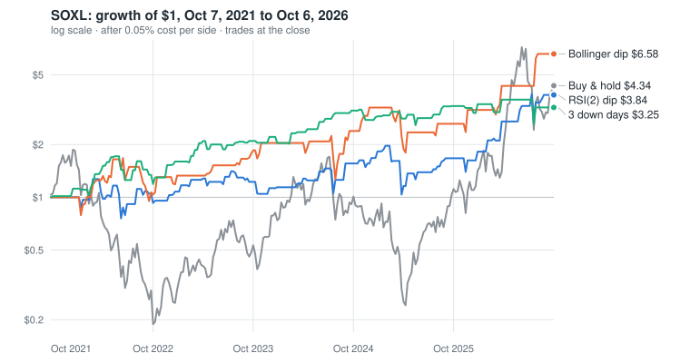
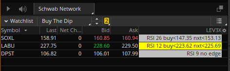
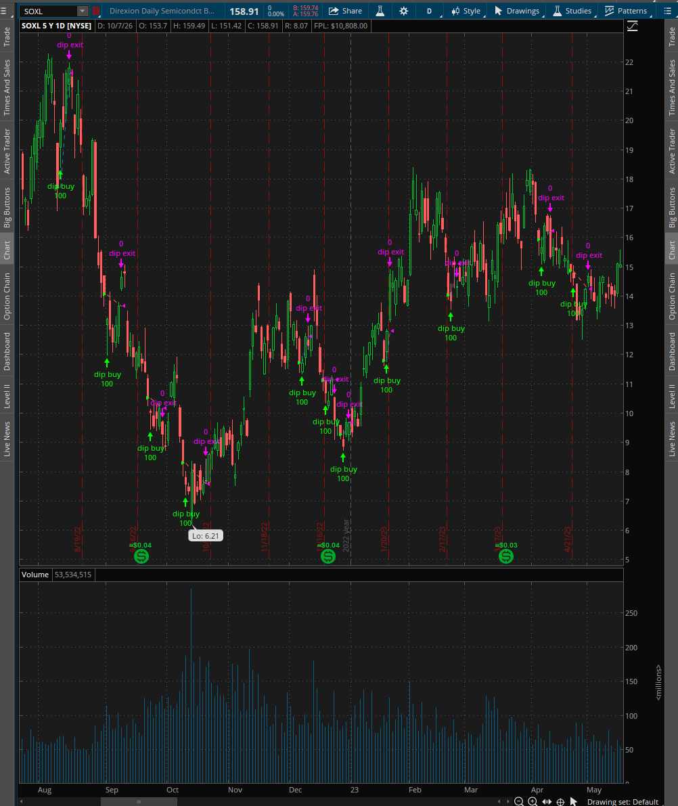

# Leveraged ETF retest: SOXL · LABU · DPST

[](https://github.com/rjtenyks/leveraged-etf-retest/actions/workflows/tests.yml)

A September study found about 40 trading patterns in two years of prices for three 3x leveraged ETFs: semiconductors (SOXL), biotech (LABU) and regional banks (DPST). This project retests every one of them over five years, keeps the few that held up, and turns those into thinkorswim studies, a strategy and a watchlist column. They were loaded into thinkorswim and gave the backtest's numbers.

I built it with Claude Code. The code, the models and every number below came out of that collaboration, and each step was checked before the next one started.



## What this repo shows

- **A question answered with data, including the answers that were no.** Most of the patterns failed the five-year test. The README says so up front.
- **Verification at every step.** Statistics were checked against textbook values. The trading rules were written twice, independently, and both versions gave identical trades. Then thinkorswim's own backtest gave the same 57 trades at the same prices.
- **Shipped into a real tool and fixed from real use.** The models run inside thinkorswim on a Windows PC. Testing them there led to four fixes. Those, and the other problems found along the way, are in [What broke and how we fixed it](#what-broke-and-how-we-fixed-it).
- **Hands-on agentic engineering.** This covers how the work was planned and checked, the guardrails used, and moving work between three machines. See [How it was built with Claude Code](#how-it-was-built-with-claude-code).

## The question

The original study covered Sep 2024 to Sep 2026. It flagged timing patterns ("Wednesdays are strong", "a flat open fades in the first hour", "buy when RSI(2) drops under 10") and rated each one as solid, worth watching, weak or no edge. Two years is short for funds that move 4–5% a day, so the question was: **which of these patterns survive five years that include the 2022 chip crash and the 2023 regional-bank crisis?**

## Results



**Trading rules, Oct 7, 2021 to Oct 6, 2026**, after 0.05% cost per side, trading at the close. "Years up" counts the five 12-month periods that made money.

| Rule | SOXL | LABU | DPST |
|---|---|---|---|
| Buy & hold | +334%, worst drawdown −91% | −77%, −97% | −75%, −94% |
| **RSI(2) under 10**, sell on a close above the 5-day average or on day 10 | **+284%**, −62%, **up 5 of 5 years** | +74%, −56%, up 3 of 5 | +16%, −68% |
| **Close under the lower Bollinger band**, sell above the 20-day average (added in the retest) | **+558%**, −53%, **up 5 of 5** | −41% | −72% |
| **3 down days in a row**, sell on the first up day | **+226%**, −31%, up 4 of 5 | +9% | −76% |
| Tuesday close to Wednesday open | +119%, mostly in year 5 | **+88%, −23%, up 5 of 5** | +9% |

**Patterns:**
- Over 189 tests, 6 cleared p < 0.05, fewer than the roughly 9.5 that luck alone produces.
- Only one survives a Benjamini–Hochberg false-discovery check: SOXL tends to slip in the last 30 minutes after being up 6% or more at 3:30 pm.
- The structure of how these funds move held up for all three: most of a day's move comes overnight and in the first hour, bad days bottom late, and big opening gaps rarely fill the same day.

The full pattern-by-pattern comparison is in [notes/soxl-labu-dpst-5yr-retest.md](notes/soxl-labu-dpst-5yr-retest.md). An interactive version, with charts for each fund and the code, is the claude.ai page [SOXL · LABU · DPST Retest](https://claude.ai/artifact/6KbNAQx5n3ZkcqvesSobm9).

**Read with care:**
- Eight rules were tried on three funds, so the best results are probably flattered.
- SOXL's five years include a long semiconductor boom.
- Hourly prices only go back to Nov 2023, so the time-of-day results cover about three years, not five.

## How it was verified

1. **The statistics, checked against textbook values.** The project uses only the Python standard library, so the Welch t-test (through the regularized incomplete beta function) and the false-discovery adjustment were written by hand. They were checked against textbook values before use, for example t = 2.0 with 10 degrees of freedom gives p = 0.0734.
2. **Every test counted.** All 189 pattern tests are counted and corrected for multiple comparisons, not just the ones that looked good.
3. **Two implementations of every rule.**
   - The thinkScript logic was re-implemented separately in Python and compared trade by trade with the backtest.
   - The first comparison found one mismatch: thinkorswim's `StDev` divides by n, the backtest divides by n−1, and that changed three trades.
   - After the fix, all 12 rule and fund pairs gave identical trade dates.
4. **Checked inside thinkorswim.**
   - The daily study showed RSI(2) 25.8 and buy triggers of 147.35 and 153.13, matching the backtest to the cent.
   - The watchlist column matched on all three rows.
   - The strategy's own report listed the same 57 SOXL trades at the same prices.
5. **Reproducible.** Running `analyze.py` again in a fresh folder gives byte-identical results.
6. **Unit tests.** The tests in [`tests/`](tests/) check the statistics against textbook values, the trade simulator against examples worked out by hand, the chart script, and the thinkScript headers. To check the tests themselves, 15 different bugs were put into the code on purpose, one at a time, and the tests caught every one. GitHub Actions runs them on every pull request and every push to `main`. They don't need the downloaded prices.

## The models in thinkorswim

| File | What it does |
|---|---|
| [`LEV3X_Dip_STUDY.ts`](studies/soxl-labu-dpst/LEV3X_Dip_STUDY.ts) | Daily chart: four dip rules, buy and sell arrows, today's and the next session's buy trigger, and a label with the rule's 5-year record on that fund |
| [`LEV3X_Dip_STRATEGY.ts`](studies/soxl-labu-dpst/LEV3X_Dip_STRATEGY.ts) | The same rules as a strategy, for thinkorswim's own backtest report |
| [`LEV3X_Dip_COLUMN.ts`](studies/soxl-labu-dpst/LEV3X_Dip_COLUMN.ts) | Watchlist column: BUY / SELL / HOLD, or RSI(2) with both buy triggers |
| [`LEV3X_Intraday_STUDY.ts`](studies/soxl-labu-dpst/LEV3X_Intraday_STUDY.ts) | 5-minute chart: gap-fill odds, the typical dip below the open, first-hour shading, and the time-of-day patterns that held |
| [`LEV3X_TueNight_STRATEGY.ts`](studies/soxl-labu-dpst/LEV3X_TueNight_STRATEGY.ts) | Buy Tuesday's close, sell Wednesday's open |

Each study reads the chart's symbol and shows that fund's own numbers. Setup steps are in [studies/soxl-labu-dpst/README.txt](studies/soxl-labu-dpst/README.txt).



The strategy replayed on SOXL, five years of daily candles:



## What broke and how we fixed it

| Problem | Root cause | Fix | Result |
|---|---|---|---|
| Time-of-day tests couldn't cover five years | Yahoo keeps about 730 sessions of hourly bars; older intraday data from Alpha Vantage is a paid endpoint | Ran those tests on the three years available, and said so everywhere | Honest scope instead of a silent gap |
| No pandas, and pip couldn't be installed on the laptop | Ubuntu's Python lacked `ensurepip` for virtual environments | Wrote the statistics on the standard library and tested them against known values | Runs anywhere with Python 3, nothing to install |
| Three extra trades on one rule in the thinkScript version | Population vs sample standard deviation | Scaled thinkorswim's `StDev` by √(60/59) | Identical trades in both versions |
| A chart's end labels read low ($4.06 instead of $4.34) | Curves were saved every 5th day, which dropped the final day | Always keep the last point | Caught by a screenshot review before release |
| Buy trigger of 158.80 instead of 147.35 | The study was on an intraday chart, so RSI(2) used minute bars | Diagnosed from how close the trigger sat to the price; documented the chart settings (1Y 1D, 5D 5m) | Values matched once on daily candles |
| "Today's trigger" was out of date after the close | The label only looked at the current session | Added the next session's trigger to the study and the column | The after-hours number is the useful one |
| First-hour shading blended into thinkorswim's own gray | Color choice | A blue the user can change in the study settings | Visible on the default dark theme |
| Strategy report dates one day later than the backtest | thinkorswim books strategy orders on the next candle | Confirmed the prices matched, then documented the shift | Trades verified as identical |
| `.ts` files couldn't be downloaded from the results page | The page viewer only allows certain file types | Built a small zip writer (stored entries, CRC-32) into the page | One-click download, checked with `unzip -t` |

## How it was built with Claude Code

- **Three machines.** Claude Code runs on an Ubuntu laptop. thinkorswim runs on a Windows PC, and a phone is used for checks on the go. Manual steps on the other machines were given one at a time, each checked before the next.
- **Instructions and memory.** A global `CLAUDE.md` holds my working preferences and security rules, and each repo has its own `CLAUDE.md`. Claude Code keeps short memory notes between sessions (how I like steps delivered, which channel to use for which machine).
- **Guardrails.**
  - Global git `pre-commit` and `pre-push` hooks run gitleaks and a list of private values on every commit in every repo. They are never bypassed.
  - Screenshots were checked for account numbers and file metadata before they went into the repo.
  - A standing rule: no passwords, card numbers, keys or account numbers in anything shared, without my explicit approval.
- **Plan mode.** The cross-machine handoff page was planned first. I corrected the plan to add the confidential-information rule and its checks, then approved it.
- **Connectors (MCP).**
  - Google Drive moved files from the PC to the laptop early on.
  - Alpha Vantage was checked as a source of intraday history, which is where the paid-data limit showed up.
- **claude.ai pages with runtime capabilities.**
  - The interactive results page has per-fund charts and Copy and Download buttons for the code.
  - A private "handoff" page has a small shared database, a file store and downloads, so notes, code and screenshots move between the laptop, the PC and the phone. The screenshots in this README arrived that way.

## Run it

Python 3, standard library only. Prices are downloaded into `data/`, which is not in the repo.

```
python3 backtests/soxl-labu-dpst/fetch_prices.py   # daily and hourly prices from Yahoo Finance
python3 backtests/soxl-labu-dpst/analyze.py        # all tests and backtests -> data/soxl-labu-dpst/results_5y.json
python3 backtests/soxl-labu-dpst/make_chart.py     # the chart above -> docs/images/soxl-growth-5y.svg
python3 -m unittest discover -s tests             # the unit tests (no prices needed)
```

On Windows, Python has no built-in time-zone database, so run `pip install tzdata` first ([Python docs](https://docs.python.org/3/library/zoneinfo.html#data-sources)). Linux and macOS need nothing extra.

Yahoo only serves recent hourly bars, so a fresh download covers a later window and gives slightly different numbers from the ones above.

## Layout

| Folder | What's in it |
|---|---|
| `backtests/soxl-labu-dpst/` | Price download, analysis and chart scripts |
| `studies/soxl-labu-dpst/` | The thinkScript files and their setup notes |
| `notes/` | The full results, pattern by pattern |
| `docs/images/` | Screenshots and the chart |
| `tests/` | Unit tests, standard library `unittest` |
| `.github/workflows/` | CI: runs the tests on every pull request |
| [`CHANGELOG.md`](CHANGELOG.md) | What was done and when |

## Disclaimer

Historical analysis for research and education, not investment advice. 3x leveraged ETFs can lose most of their value quickly. thinkorswim is a Charles Schwab platform; this project isn't affiliated with Schwab or Direxion.

The code is shared for review. All rights reserved.
